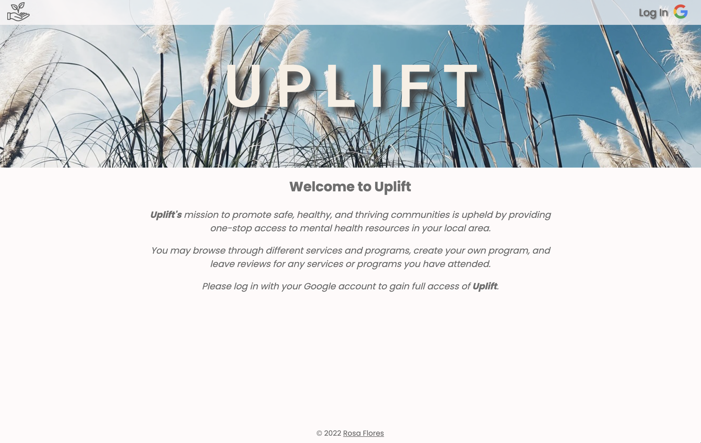
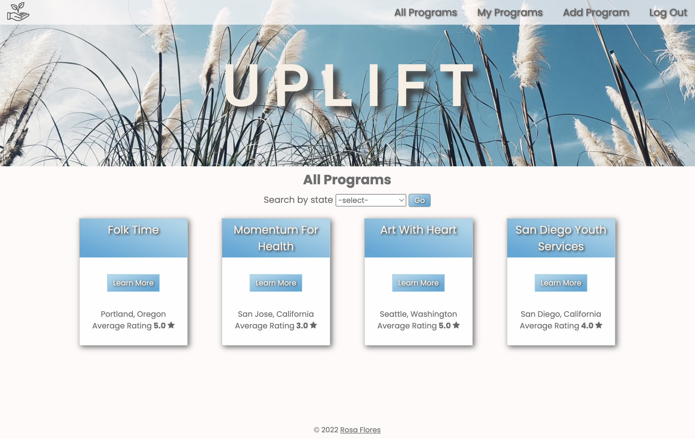
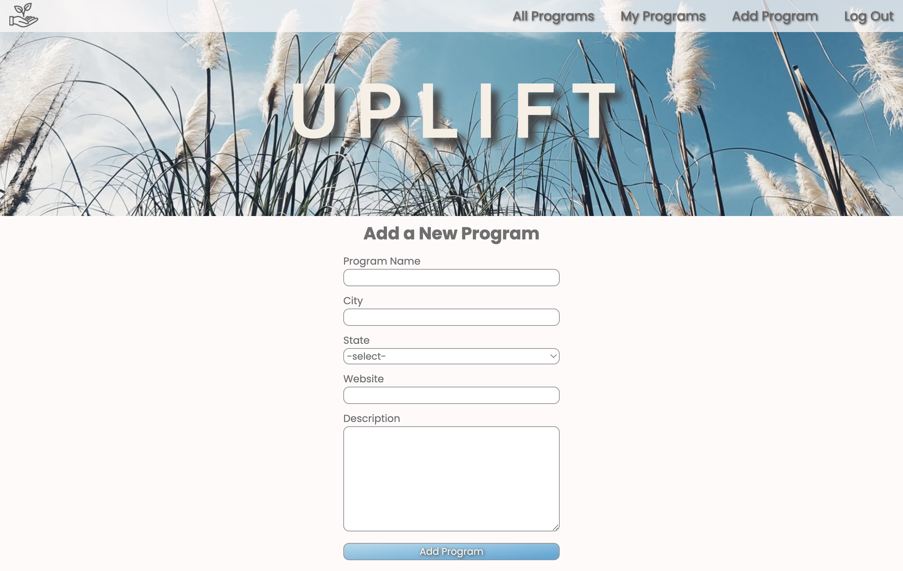
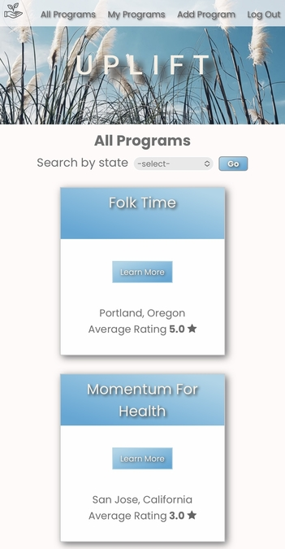

# **Uplift**
Uplift is a full CRUD application that serves as a one-stop mental health resource page. Once users log in, they are able to search for different mental health programs and services, and are able to narrow their search by filtering out programs by state. 

Additionally, logged in users can leave reviews for any program on the page, create a new program, and edit or delete any program they created.
#
## **Getting Started**

Visit Uplift [here](https://uplift-mental-health.herokuapp.com/)

Check out my Trello planning board [here](https://trello.com/b/637pQbk2/project-2)
# 
## **Screenshots**

# 
## **Technologies Used** 
- EJS 
- CSS 
- JavaScript
- Node.js
- MongoDB / Mongoose 
- Express
- Heroku
- Google Oauth 2.0
- Passport
# 
## **Next Steps** 
- Add a 'Favorites' button to each program to allow users to favorite programs that they are interested in. 
- Create a 'Favorites' tab in the navigation bar which is where the favorited programs would be stored for users.
- Add additional filter options to allow users to filter out their program search based on city location, average rating, and the type of services they are looking for.
